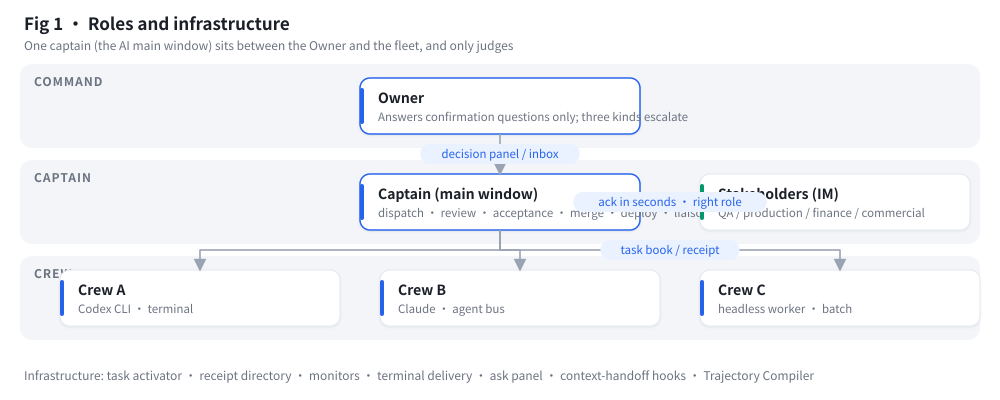
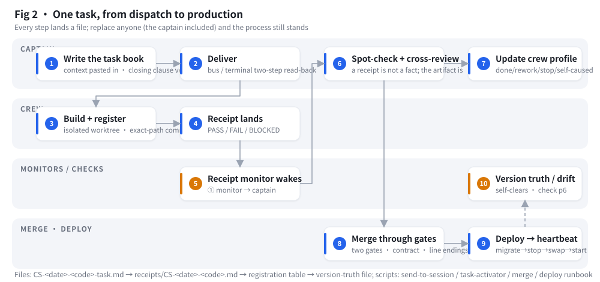
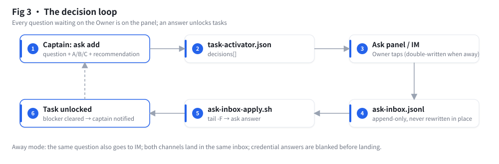
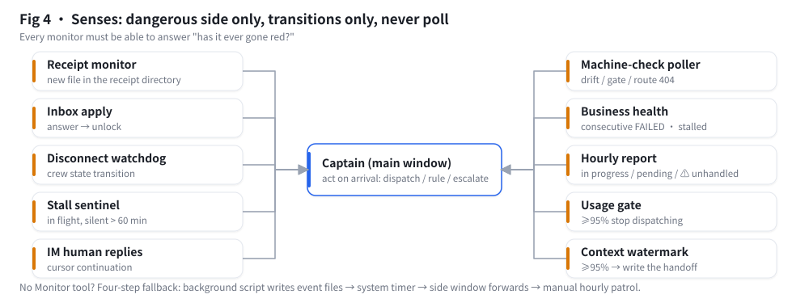
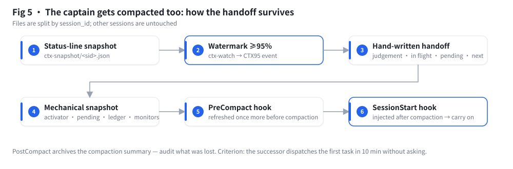
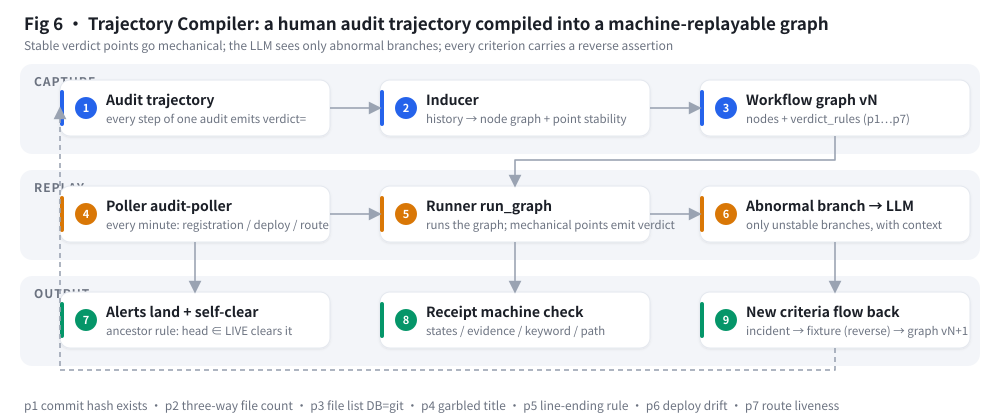

# How it works (10 minutes)

**语言 / Language:** [中文](mechanism.md) · [English](mechanism.en.md)

### 1. Roles and infrastructure



- **Owner** only answers confirmation questions (A/B/C with a recommendation). Only three things are escalated: irreversible production actions, business facts only a human knows, outward-facing publication.
- **Captain** is one resident AI session (the "main window"). It only judges: writes task books, dispatches, reviews, accepts, merges, deploys, talks to stakeholders, keeps the decision panel. Writing business code itself is a violation.
- **Crew** are independent terminal AI sessions, mixable (Codex CLI, Claude Code, headless workers), each with its own worktree, context and quota.
- **Infrastructure** is just files and small scripts: task activator, receipt directory, monitors, terminal delivery, floating ask panel, context-handoff hooks, trajectory compiler.

### 2. One task, from dispatch to production



| Step | Who | What | Files / scripts |
|---|---|---|---|
| ① | Captain | Write the task book: context pasted in, read whitelist ≤5 files, one verification command, closing clause verbatim (receipt path + three states + keyword + main-window session ID) | `CS-<date>-<code>-task.md` (`templates/01`) |
| ② | Captain | Deliver: same-harness via the agent bus; CLI crew via the terminal's two-step delivery (write → read back keyword → only then press Enter) | `scripts/send-to-session.sh` (iTerm2 reference), `specs/delivery-terminal.en.md` |
| ③ | Crew | Build in an isolated worktree, commit with explicit paths after every file, register the change | registrar (self-verifies in the same transaction) |
| ④ | Crew | Write the receipt: PASS / FAIL / BLOCKED all land on disk; never stop at checkpoints | `receipts/CS-<date>-<code>.md` (`templates/02`) |
| ⑤ | Monitor | New file in receipt directory → event to the captain | `specs/monitors.en.md` ① |
| ⑥ | Captain | Accept: verify anything a single command can verify (SELECT, cmp, look at the commit); dispatch cross-model review; update the crew profile | `task-activator.py set`, `crew/<code>.md` |
| ⑦ | Captain | Merge through the gates: two build gates + contract baseline with zero new reds + line-ending double rule + registration self-check | pitfalls in `doctrine/04` |
| ⑧ | Captain | Deploy: migrations before the jar → **stop first, then swap** → inject credentials and start → pin the frontend → write the version-truth file; done only when the next business heartbeat succeeds | `skill/SKILL.en.md §7` |
| ⑨ | Machine check | version truth ≠ integration head → drift alert; self-clears by ancestor rule after deploy | `trajectory/` |

### 3. Decision loop



Captain runs `task-activator.py ask add Q12 "<question + A/B/C + recommendation>" --tasks X,Y` → the floating panel (`scripts/askpanel/`) shows unanswered questions → Owner taps one → a line is appended to `ask-inbox.jsonl` → `ask-inbox-apply.sh` picks it up → `ask answer` → blockers on tasks X and Y are cleared → captain is notified. In away mode the same question is also sent over IM (`specs/away-mode.en.md`); both channels land in the same inbox.

### 4. Senses



Monitoring is not "watching logs"; it delivers the **events that would change the captain's next action**: a receipt arrived, the Owner answered, a crew session died, a task has been silent for an hour, the business heartbeat failed repeatedly, the context window is nearly full. Three hard rules: report only the dangerous side, report only state transitions, never poll. If the harness has no Monitor-type tool, build senses with the four-step fallback (background script writing event files → system timer delivering a line → delegate watching to a side session → hourly manual patrol).

### 5. The captain itself gets compacted: handoff that survives



Status line writes the session's context usage → a Monitor watches for ≥95% → captain writes the hand-written handoff section (current judgement / in-flight & criteria / pending decisions / next three steps / risks & backups / coordinates) → a script appends the mechanical section (activator, pending questions, ledger tail, monitor list) → PreCompact hook refreshes it once more as a safety net → after compaction the SessionStart hook injects the handoff back into context. Files are per session ID, so other sessions are untouched.

### 6. Trajectory Compiler: the machine audits the process



Record the trajectory of auditing one change (each step SQL / git / compare with a `verdict=`), let the inducer derive a node graph and the stability of each verdict point; stable points (p1 commit exists, p2 three-way file count, p3 file list DB=git, p4 garbled title, p5 line-ending double rule, p6 deploy drift, p7 route liveness) are replayed mechanically by the runner; only unstable branches go to a model; the poller runs every minute, alerts land on disk and self-clear by the ancestor rule. **Mechanical points cost zero model tokens; the model is paid only for abnormal branches — measured: from ~12k tokens and minutes per change to 0 calls / 0.6 s.** Logic and principles: [`docs/trajectory.en.md`](trajectory.en.md).

### 7. A real day (anonymised)

```
08:05  low-traffic deploy window: backup → run migrations twice (ERROR=0) → stop, then swap jar → inject creds, start in 6.3 s → pin frontend → version truth
08:12  business heartbeat SUCCESS (the finishing criterion) → 08:13 drift alert self-clears → tell the production lead that four fixes are live
08:16  Owner answers three questions on the floating panel (Q29=A / Q30 / Q31=A) → inbox → three tasks unlocked
08:4x  two task books written and delivered (crew B: BOM step 1; crew C: entity backfill addendum); confirmation sheet sent to the production lead
09:0x  crew B lands a plan receipt within 30 min and keeps building; crew C runs a clone drill + counterexamples + result sheet + production SQL generated but not executed
09:3x  two receipts land → monitor wakes the captain → captain spot-checks registrations and anchors → one PASS goes to review, one BLOCKED is ruled and filed
09:5x  hourly report: in progress 5 · pending 34 (ready 0 / waiting on decisions 34) · done 59; no unhandled receipts
```
