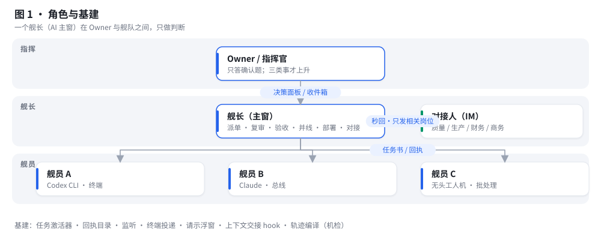
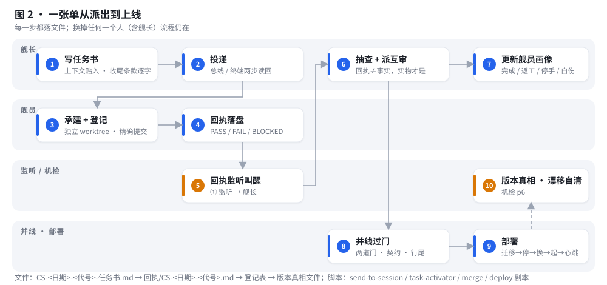
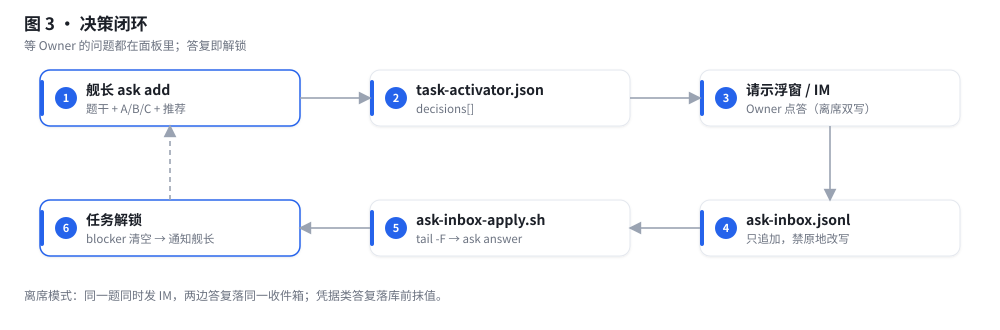
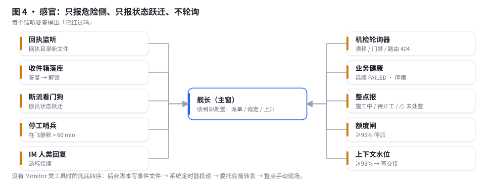
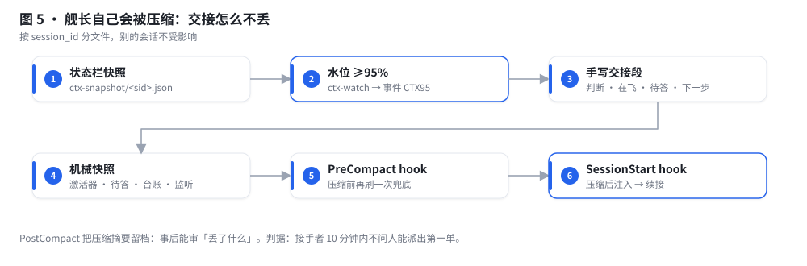
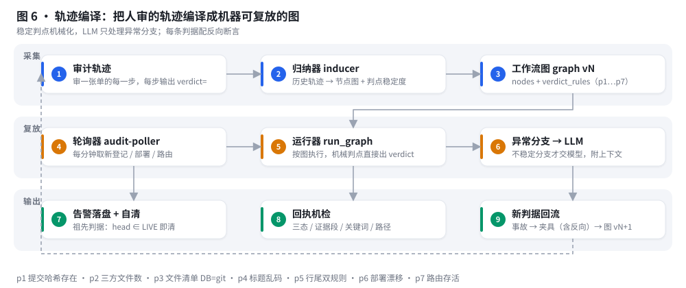

# 工作机制（10 分钟看懂）

**语言 / Language：** [中文](mechanism.md) · [English](mechanism.en.md)

### 1. 角色与基建



- **Owner** 只答确认题（A/B/C + 推荐），只有三类事会被上升：不可逆生产面、只有人类知道的业务事实、对外发布。
- **舰长**是一个常驻的 AI 会话（主窗），只做判断：写任务书、派单、复审、验收、并线、部署、对接人沟通、维护决策面板。自己写业务代码=违例。
- **舰员**是若干独立终端 AI 会话，可混编（Codex CLI、Claude Code、无头工人机），各自独立 worktree / 上下文 / 额度。
- **基建**全是文件和小脚本：任务激活器（`task-activator.json`）、回执目录、监听、终端投递、请示浮窗、上下文交接 hook、轨迹编译。

### 2. 一张单从派出到上线



| 步 | 谁 | 做什么 | 落下什么文件 / 用什么脚本 |
|---|---|---|---|
| ① | 舰长 | 写任务书：上下文贴入、白名单 ≤5、验证命令唯一、收尾条款逐字（回执路径 + 三态 + 关键词 + 主窗会话 ID） | `CS-<日期>-<代号>-任务书.md`（模板 `templates/01`） |
| ② | 舰长 | 投递：同 harness 走总线；CLI 舰员走所在终端的两步投递（写入 → 读回关键词 → 才补回车） | `scripts/send-to-session.sh`（iTerm2 参考实现）、`specs/delivery-terminal.md` |
| ③ | 舰员 | 独立 worktree 承建，每文件改完立刻精确路径提交，写变更登记 | 登记器（登记后同事务反查） |
| ④ | 舰员 | 回执落盘：PASS / FAIL / BLOCKED 皆落盘，检查点不停手 | `回执/CS-<日期>-<代号>.md`（模板 `templates/02`） |
| ⑤ | 监听 | 回执目录有新文件 → 事件送到舰长 | `specs/monitors.md` ① |
| ⑥ | 舰长 | 收单：一条命令能验的当场验（SELECT 反查、cmp、看 commit）；派另一模型互审；更新舰员画像 | `task-activator.py set`、`crew/<代号>.md` |
| ⑦ | 舰长 | 并线过门：两道构建门 + 契约基线零新红 + 行尾双规则 + 登记自证 | `doctrine/04` 里的门禁坑 |
| ⑧ | 舰长 | 部署：迁移先于 jar → **先停后换** → 注入凭据起服 → 钉前端 → 写版本真相；收尾判据=下一轮业务心跳成功 | `skill/SKILL.md §7` |
| ⑨ | 机检 | 版本真相 ≠ 集成头 → 漂移告警；部署后按祖先判据自清 | `trajectory/`（轨迹编译） |

### 3. 决策闭环：问题怎么到 Owner 手里、答复怎么变成解锁



舰长 `task-activator.py ask add Q12 "<题干+A/B/C+推荐>" --tasks X,Y` → 浮窗（`scripts/askpanel/`）展示未答题 → Owner 点一下 → 一行追加进 `ask-inbox.jsonl` → `ask-inbox-apply.sh` 读到 → `ask answer` → 任务 X、Y 的 blocker 清空 → 通知舰长。Owner 离席时同一题同时发到 IM（`specs/away-mode.md`），两边答复落同一收件箱。

### 4. 感官：舰长怎么知道该动了



监听不是「看日志」，是把**会改变舰长动作的事件**送到它面前：回执到了、Owner 答了、舰员断流了、在飞单静默一小时了、业务心跳连续失败了、上下文快满了。三条硬规矩：只报危险侧、只报状态跃迁、不轮询。harness 没有 Monitor 类工具时按兜底四序（后台脚本写事件文件 → 系统定时器投递 → 委托旁窗转发 → 整点手动巡场）自建感官。

### 5. 舰长自己会被压缩：交接怎么不丢



状态栏每次渲染写本会话水位 → Monitor 盯 ≥95% → 舰长手写交接段（当前判断 / 在飞与判据 / 待答 / 下一步三件 / 风险与备份 / 坐标）→ 脚本拼机械段（激活器、待答、台账尾、监听清单）→ 压缩前 hook 再刷一次兜底 → 压缩后 SessionStart hook 把交接注入回上下文。按 session_id 分文件，别的会话不受影响。

### 6. 轨迹编译：机器替舰长审流程



把人审一张单的轨迹（每步 SQL / git / compare + `verdict=`）交给归纳器，归纳出节点图和判点稳定度；稳定的判点（p1 哈希存在、p2 三方文件数、p3 清单一致、p4 标题乱码、p5 行尾双规则、p6 部署漂移、p7 路由存活）由运行器机械复放，只有不稳定分支才交给模型；轮询器每分钟跑一遍，告警落盘并按祖先判据自清。**机械判点零模型 token，模型只为异常分支付费：实测每单从约 1.2 万 token / 分钟级降到 0 调用 / 0.6 秒**。逻辑与原理见 [`docs/trajectory.md`](trajectory.md)。

### 7. 一天的真实时间线（脱敏）

```
08:05  低峰部署窗：备库 → 迁移两遍 ERROR=0 → 先停后换 jar → 注入凭据起服 6.3s → 钉前端 → 版本真相
08:12  业务心跳 SUCCESS（收尾判据）→ 08:13 漂移告警按祖先判据自清 → 通知生产负责人四条修复已生效
08:16  Owner 在浮窗点答三题（Q29=A / Q30 / Q31=A）→ 收件箱落库 → 三个任务解锁
08:4x  两张任务书写好投递（舰员乙做 BOM 第 1 步、舰员丙做主体回填增补），确认表发生产负责人
09:0x  舰员乙 30 分钟内先落计划回执再不停手施工；舰员丙克隆演练 + 反例 + 结果表 + 只生成不执行的生产 SQL
09:3x  两份回执落盘 → 监听叫醒 → 舰长抽查登记与锚 → 一份判 PASS 转互审，一份 BLOCKED 由舰长裁定备案通过
09:5x  整点报：施工中 5 · 待开工 34（可开工 0 / 卡口径 34）· 已完成 59；无回执未处置
```
